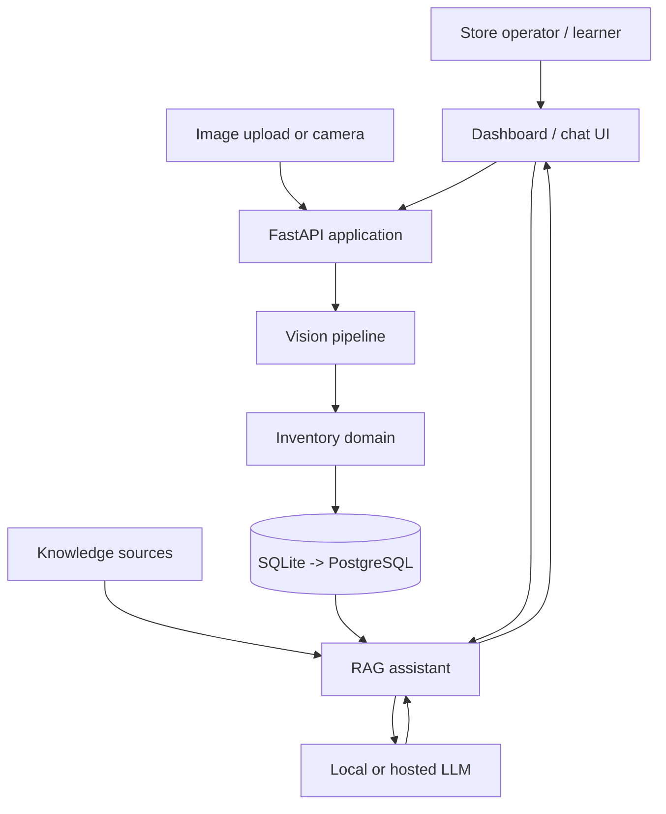
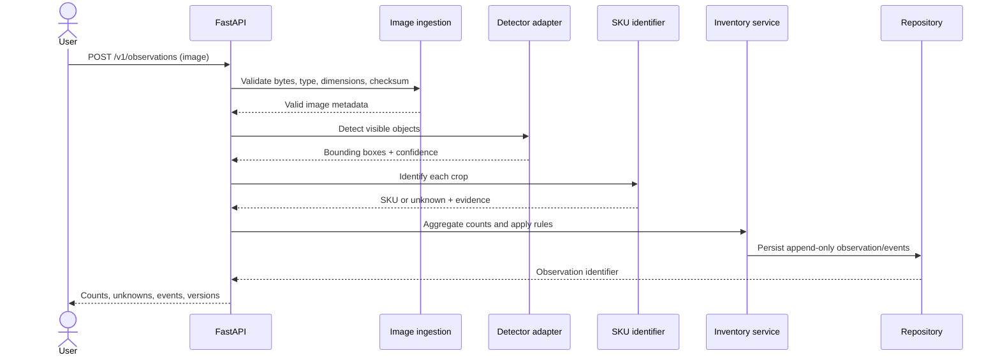
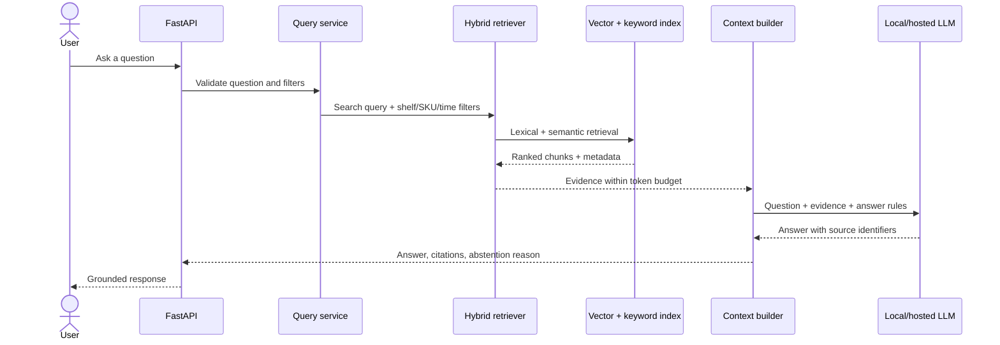
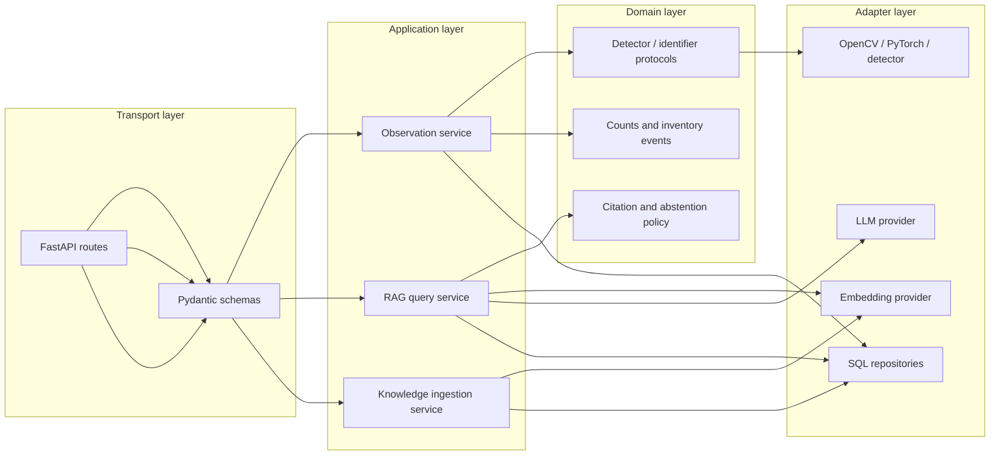
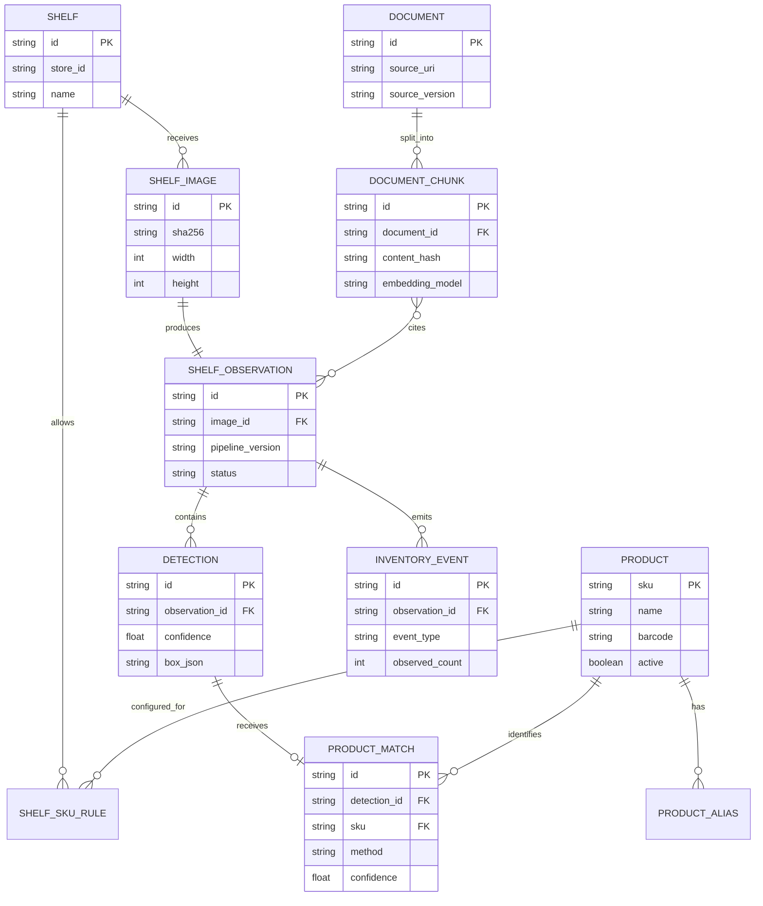
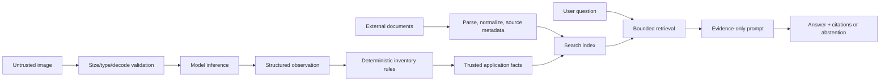
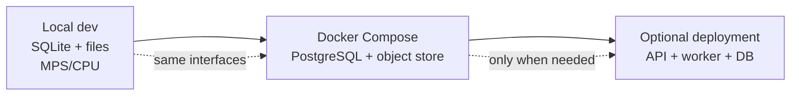

# ShelfSense architecture

## 1. Mental model

ShelfSense has three distinct responsibilities:

- **Vision** observes what is visible in an image.
- **Inventory** turns observations into counts and business events.
- **RAG** finds relevant trusted context and helps a person understand the data.

The boundaries matter. A language model must not silently change a detected count, and a detector must not be expected to answer questions about store policy.

## 2. System context

## 3. Request flow: image to observation

## 4. RAG flow: question to grounded answer

## 5. Internal layers

## 6. Data model

## 7. Trust boundaries

Security rule: retrieved documents are data. They are never treated as instructions that can override application policy, call tools, or modify counts.

## 8. Deployment progression

We do not start with cloud infrastructure. The first useful system should run on the M3 with local data and explicit model/provider adapters.
