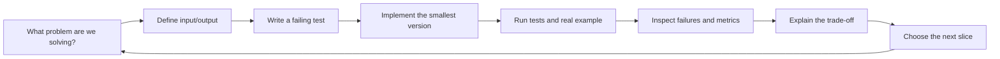

# ShelfSense learning guide

## How to use this repository

This project is a course with a working codebase. Each lesson should leave you with:

- one new behavior;
- a test for that behavior;
- a command you ran yourself;
- an explanation you can give in your own words;
- a short learning record.



## Suggested lesson order

| Lesson | Build | Main concepts |
| --- | --- | --- |
| 1 | Health endpoint and settings | HTTP, configuration, test seams |
| 2 | Image validation | bytes, decoding, limits, errors |
| 3 | Detector protocol and fake detector | interfaces, dependency injection, fixtures |
| 4 | First detector adapter | inference, boxes, confidence, device selection |
| 5 | Product catalog and SKU matching | labels, crops, unknown/abstention |
| 6 | Counts and inventory rules | domain modeling, persistence, invariants |
| 7 | Observation API | schemas, upload contracts, integration tests |
| 8 | RAG contract | retrieval evidence, citations, abstention |
| 9 | Structured retrieval | SQL filters, query interpretation |
| 10 | OMLX embedding adapter | local HTTP, model IDs, timeouts |
| 11 | Hybrid retrieval and reranking | FTS, vectors, ranking evaluation |
| 12 | Grounded RAG generation | prompt boundaries, citations, answer tests |
| 13 | Dashboard | frontend contracts and product workflow |

## The rule for model work

Do not start by downloading a large model. Start with a fake or deterministic adapter so the application contract is clear. Then use a small real model and measure it on a small held-out fixture set.

```mermaid
flowchart TD
    Fake["Fake detector / fake retriever"] --> Contract["Stable application contract"]
    Contract --> Small["Small real model"]
    Small --> Evaluate["Measure quality, latency, memory"]
    Evaluate --> Decide{ "Evidence supports expansion?" }
    Decide -- "No" --> Debug["Inspect failures"]
    Debug --> Small
    Decide -- "Yes" --> Expand["Add next capability"]
```

## Session checklist

Before coding:

- What is the single behavior?
- What should happen for invalid input?
- What evidence will tell us that it works?

After coding:

- Did the focused test pass?
- Did the full checks pass?
- Did we run it on a real or representative fixture?
- What does it still fail to do?
- What did we learn?
