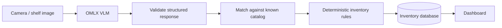
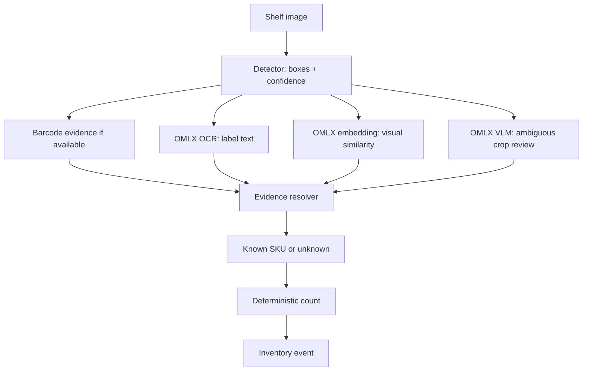
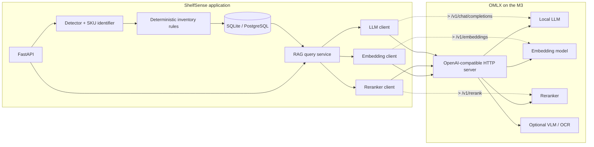
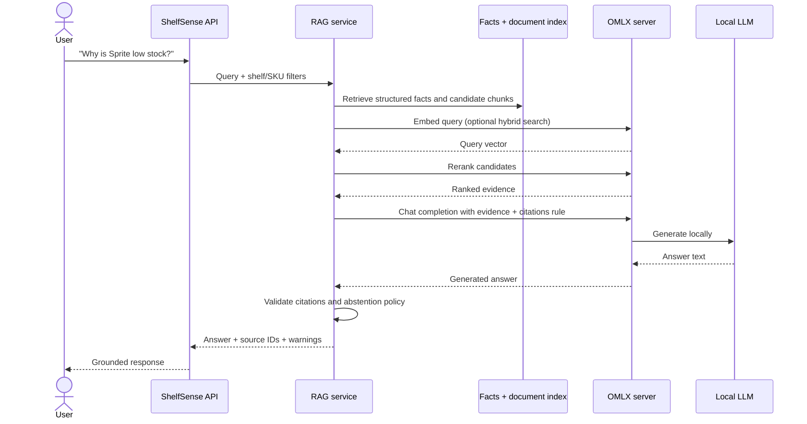
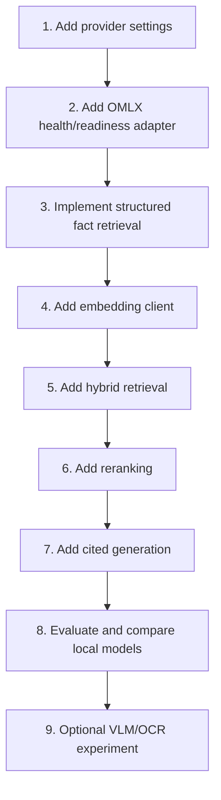

# OMLX integration

## Short answer

Use OMLX as a local HTTP inference server behind ShelfSense’s provider interfaces:

- **LLM generation** for grounded RAG answers;
- **embeddings** for semantic document retrieval;
- **reranking** to improve retrieval ordering;
- optionally **VLM/OCR** as secondary evidence for difficult labels.

Keep the primary shelf detector and inventory rules separate. OMLX is a model-serving dependency, not the source of truth for product counts.

## Why it fits this project

OMLX is designed for Apple Silicon and exposes OpenAI-compatible endpoints. Its project documentation describes support for text LLMs, vision-language models, OCR models, embeddings, and rerankers, with a local server at `http://localhost:8000/v1` by default. That lets ShelfSense call local models through a stable HTTP interface instead of embedding one model runtime throughout the application.

Relevant OMLX endpoints:

| Endpoint | ShelfSense use |
| --- | --- |
| `GET /v1/models` | Discover the configured model IDs |
| `POST /v1/chat/completions` | Generate a cited RAG answer |
| `POST /v1/embeddings` | Embed catalog and document chunks |
| `POST /v1/rerank` | Reorder retrieved candidates |
| `POST /v1/messages` | Optional Anthropic-compatible client path |
| `GET /health` | Readiness check for local inference |

Verify endpoint details against the installed OMLX version before coding against them; this is a fast-moving project.

## 2. Where OMLX can sit in the camera path

Yes, OMLX can be used after the camera or shelf image. There are two valid designs:

### Design A — direct VLM prototype



The VLM receives the complete image and proposes something like:

```json
{
  "shelf_id": "B4",
  "products": [
    {"sku": "coke_330ml", "count": 3},
    {"sku": "pepsi_bottle", "count": 2}
  ],
  "warnings": ["Some products are partially occluded"]
}
```

This is a good **learning prototype** because it is fast to build and teaches multimodal requests, structured output, prompt design, and evaluation.

It is not automatically reliable. A VLM can miss an item, count the same item twice, confuse similar packaging, or make up a shelf position. We must compare its output to human labels before trusting it.

### Design B — hybrid detector + OMLX vision


This is the recommended product architecture. The detector owns **where** the objects are. OMLX helps determine **what** each crop is, reads difficult text, or compares the crop with catalog evidence. The inventory service owns **how many** and **what event** follows.

### Design C — production-oriented staged pipeline



Use Design A first to learn quickly. Move toward Design B/C when measured failure modes justify the extra stages.

### What comes from where

| Output | Best source | Why |
| --- | --- | --- |
| Product location / bounding box | Object detector | Boxes and IoU are directly measurable |
| Shelf identity `B4` | Request metadata, shelf configuration, marker/QR, or calibrated camera | Do not rely on a free-form model guess |
| Product identity | Closed-catalog classifier, barcode, embedding, OCR, or VLM | Combine evidence and allow `unknown` |
| Count | Validated detections + deterministic aggregation | Auditable and repeatable |
| Low-stock event | Inventory rules | Business logic should not live in a prompt |
| Natural-language explanation | OMLX LLM after retrieval | Generation is useful once facts are stored |

The important correction to the original diagram is:

```text
camera
  -> detector and/or OMLX VLM
  -> validated product evidence
  -> deterministic SKU counts
  -> inventory database
  -> dashboard
```

OMLX absolutely can be in the vision path. It should not be the only unvalidated authority for inventory counts in the final system.

## 3. Why keep a detector if a VLM can see the whole image?

A detector is specialized for finding repeated, overlapping objects and returning coordinates. A VLM is specialized for interpreting a multimodal prompt and producing a broader answer. Retail shelves are a difficult case for a general VLM because products are dense, partially hidden, visually similar, and repeated many times.

Keeping the detector gives us:

- one box per candidate object;
- measurable localization quality;
- crops that can be inspected independently;
- a way to count repeated products without asking a language model to do arithmetic;
- error diagnostics for missed, duplicated, or overlapping detections.

Keeping OMLX in the pipeline gives us:

- local VLM/OCR experiments;
- local embeddings and reranking for product catalog matching;
- a local LLM for RAG explanations;
- one OpenAI-compatible HTTP boundary for these model roles.

## 4. The final answer contract

Regardless of which vision design produced the candidates, the application should only persist a validated observation:

```json
{
  "shelf_id": "B4",
  "products": [
    {
      "sku": "coke_330ml",
      "count": 3,
      "confidence": 0.91,
      "evidence": ["detector:det_001", "catalog:sku_coke_330ml"]
    },
    {
      "sku": "pepsi_bottle",
      "count": 2,
      "confidence": 0.84,
      "evidence": ["detector:det_004", "omlx_vlm:match_004"]
    }
  ],
  "unknown_count": 1,
  "warnings": ["One product is partially occluded"],
  "pipeline_version": "vision-omlx-hybrid-v1"
}
```

A model response is a **candidate**. The application validates:

1. JSON/schema shape;
2. SKU exists in the configured catalog;
3. boxes are within image bounds;
4. counts are derived from accepted detections;
5. confidence and evidence are present;
6. uncertainty becomes `unknown` or a warning;
7. only then is the observation stored.

## 5. The boundary in our architecture



## What OMLX should and should not do

| Responsibility | Owner | Reason |
| --- | --- | --- |
| Find product boxes | Detector adapter | Object detection is measurable with boxes, IoU, precision, and recall |
| Decide SKU counts | Inventory domain | Counts must be deterministic and auditable |
| Store observations/events | ShelfSense database | The app needs durable versioned facts |
| Embed knowledge chunks | OMLX embedding endpoint | Local semantic representation |
| Rerank search candidates | OMLX rerank endpoint | Improve evidence ordering |
| Write a natural-language explanation | OMLX LLM endpoint | Generation is useful after evidence is retrieved |
| Read difficult package text | Optional OMLX OCR/VLM | Secondary evidence; never silently changes counts |

The critical rule is:

```text
OMLX may explain a stored observation.
OMLX may not invent or overwrite the observation.
```

## Local setup concept

OMLX’s official repository documents the following server pattern:

```bash
# Example; follow the OMLX release documentation for installation.
omlx serve --model-dir ~/models
```

The model directory contains MLX-format model subdirectories. After the server starts, inspect the actual model IDs instead of guessing them:

```bash
curl http://127.0.0.1:8000/health
curl http://127.0.0.1:8000/v1/models
```

If API-key authentication is enabled, send the key through an environment variable. Never commit it to `.env.example`, Git, prompts, or logs.

## ShelfSense configuration contract

These are the configuration values the future provider adapter should support. They are a contract for the design, not claims that the current code already reads them:

```dotenv
SHELFSENSE_OMLX_BASE_URL=http://127.0.0.1:8000/v1
SHELFSENSE_OMLX_API_KEY=
SHELFSENSE_OMLX_LLM_MODEL=<model-id-from-v1-models>
SHELFSENSE_OMLX_EMBEDDING_MODEL=<embedding-model-id-from-v1-models>
SHELFSENSE_OMLX_RERANK_MODEL=<reranker-model-id-from-v1-models>
SHELFSENSE_OMLX_TIMEOUT_SECONDS=60
```

The provider interface should make OMLX replaceable:

```python
class TextGenerationProvider(Protocol):
    async def generate(self, request: GenerationRequest) -> GenerationResponse: ...


class EmbeddingProvider(Protocol):
    async def embed(self, texts: list[str]) -> list[list[float]]: ...


class RerankerProvider(Protocol):
    async def rerank(self, query: str, documents: list[str]) -> list[RankedDocument]: ...
```

The domain and RAG services depend on these interfaces, not on `omlx` Python internals.

## RAG request path with OMLX



## Suggested model roles

Do not choose models by name until we measure them on the M3 and on our own questions. Choose by role:

1. **Generation model** — small local instruction model for concise cited answers.
2. **Embedding model** — model with a compatible `/v1/embeddings` implementation and acceptable retrieval quality.
3. **Reranker** — optional model for ordering a small candidate set.
4. **VLM/OCR model** — optional and only for image-text evidence experiments.

With 18 GB unified memory, begin with small quantized models and load only what the current experiment needs. OMLX can serve multiple model types, but “can serve” does not mean all models fit comfortably at the same time. Measure peak memory, latency, and model swapping before pinning models.

## Implementation sequence



### Step 1 — Provider settings

Add validated settings for base URL, optional API key, model IDs, timeout, retry limit, and maximum context. Keep secrets out of logs.

**Exit criterion:** invalid configuration fails at startup; a missing OMLX server produces a clear readiness status.

### Step 2 — Health/readiness adapter

Call `/health` and `/v1/models`. Report whether the required LLM, embedding, and reranker IDs are available.

**Exit criterion:** tests cover healthy, unavailable, unauthorized, timeout, and missing-model responses.

### Step 3 — Structured fact retrieval

Answer inventory questions using SQL facts before adding semantic retrieval. This creates a reliable baseline.

**Exit criterion:** a question about a known observation returns the correct observation ID and count without an LLM.

### Step 4 — Embedding client

Call `/v1/embeddings` for document chunks and queries. Store the embedding model ID and dimensions with every index revision.

**Exit criterion:** repeated input produces a stable vector shape, failures are bounded, and index metadata records the model.

### Step 5 — Hybrid retrieval

Combine exact filters/FTS with semantic search. Exact SKU and barcode matches must not be lost to semantic similarity.

**Exit criterion:** retrieval recall is measured on a versioned question set.

### Step 6 — Reranking

Use `/v1/rerank` only after retrieval works. Reranking changes order; it does not create evidence.

**Exit criterion:** reranking improves or does not degrade citation precision on the evaluation set.

### Step 7 — Cited generation

Call `/v1/chat/completions` with bounded evidence and a structured response contract. Validate that citations point to retrieved source IDs.

**Exit criterion:** supported questions answer with citations; unsupported questions abstain.

### Step 8 — Evaluate

Compare model roles using the same evidence and questions. Record OMLX version, model IDs, quantization, context, device, latency, peak memory, retrieval metrics, and answer metrics.

**Exit criterion:** model choice is evidence-backed rather than based on a benchmark screenshot or fluent demo.

## Failure modes to design for

- OMLX is stopped or still loading a model.
- Required model ID is not available.
- API-key mismatch or accidental network exposure.
- Request timeout while the model is loading/swapping.
- Embedding dimension changes between index versions.
- Reranker returns an invalid or partial response.
- LLM gives an uncited answer despite prompt instructions.
- Retrieved document contains prompt-injection text.
- Local model lacks a reliable tool/JSON format.
- Memory pressure causes swapping or affects the vision model.

All of these should become observable test cases, not surprises in the dashboard.

## Sources

- [OMLX website](https://omlx.ai/) — product overview and capabilities.
- [OMLX GitHub repository](https://github.com/jundot/omlx) — current installation, CLI, model discovery, and API compatibility documentation.
- [OMLX server source](https://github.com/jundot/omlx/blob/main/omlx/server.py) — endpoint implementation and compatibility details.

The OMLX project changes quickly. Pin and record the version used for each experiment.
