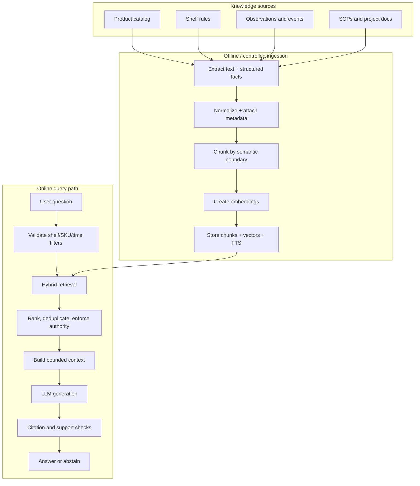
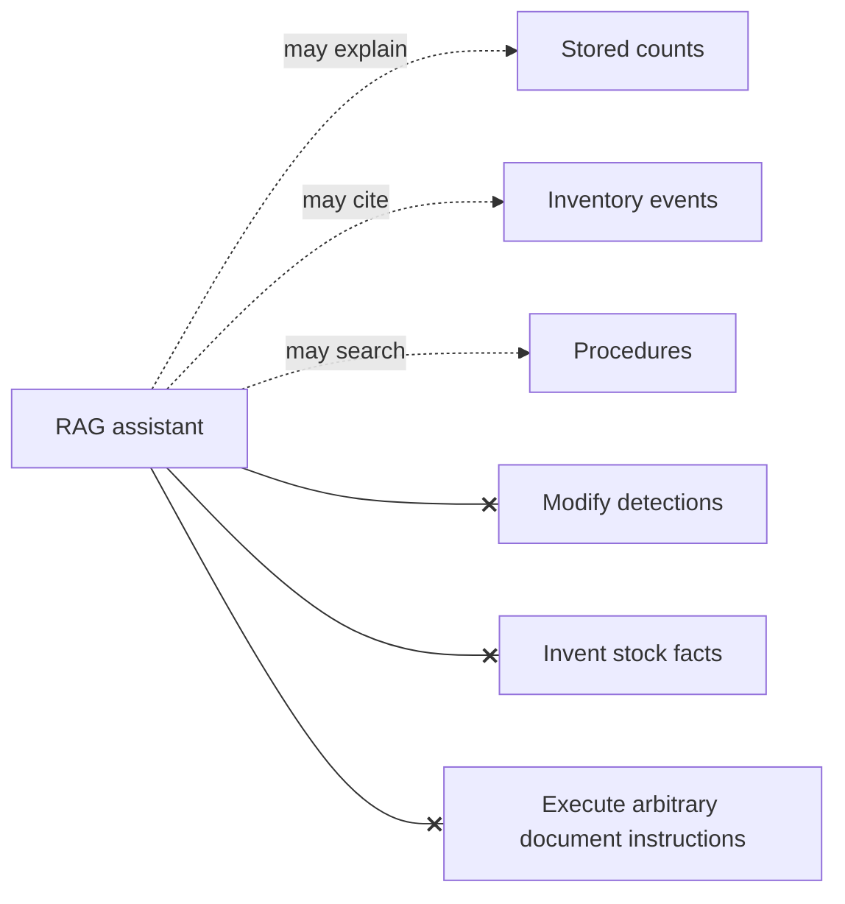
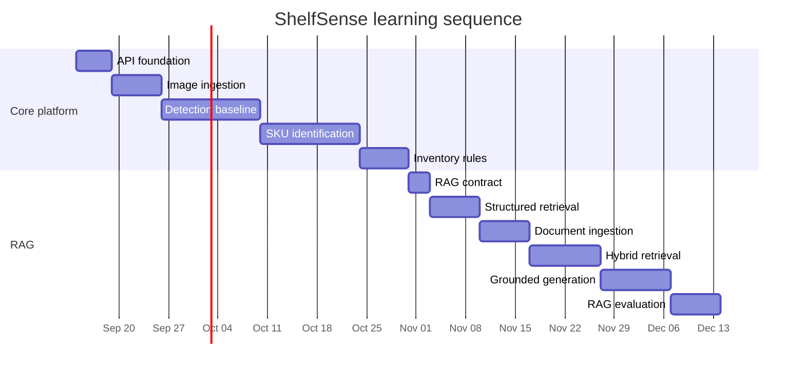

# RAG system plan

## 1. What RAG adds to ShelfSense

RAG means **retrieval-augmented generation**:

1. Find relevant information from a controlled knowledge base.
2. Give only that evidence to a language model.
3. Generate an answer that cites the evidence.

For ShelfSense, RAG is a natural-language explanation and search layer. Example questions:

- “Why is Sprite 330ml marked low stock on Shelf A3?”
- “Show the observations where Fanta was out of stock this week.”
- “What is the configured capacity for Coke Zero on Shelf A3?”
- “Which operating procedure applies when a product is unknown?”

RAG should not answer by guessing from general model knowledge, and it should not replace deterministic inventory calculations.

## 2. What belongs in the knowledge base

| Source | Example | Authority | First phase |
| --- | --- | --- | --- |
| Product catalog | SKU name, barcode, aliases | High | Yes |
| Shelf configuration | Allowed SKU, capacity, location | High | Yes |
| Inventory observations | Count, confidence, timestamp | High | Yes |
| Inventory events | Low-stock/out-of-stock decisions | High | Yes |
| Operations documentation | Restocking or review procedure | Medium/high | Later |
| Model evaluation reports | Known failure modes and metrics | Medium | Later |
| Raw images | Original shelf photo | Not text by itself | Metadata only |

Each source receives metadata: source type, identifier, version, timestamp, owner, checksum, and authority level.

## 3. RAG architecture



## 4. Recommended build order

### RAG-0 — Define the contract

Before an LLM is added, define:

- question and response schemas;
- citation shape;
- maximum retrieved context;
- filter fields such as shelf, SKU, and time range;
- abstention behavior;
- prohibited claims;
- whether an answer is allowed to include a recommendation.

Example response shape:

```json
{
  "answer": "Sprite 330ml is low stock because 2 units were observed against a configured capacity of 12.",
  "citations": [
    {"source_type": "observation", "source_id": "obs_123"},
    {"source_type": "shelf_rule", "source_id": "shelf_a3_sprite"}
  ],
  "confidence": "supported",
  "warnings": []
}
```

### RAG-1 — Structured fact retrieval

Start without embeddings. Query SQLite directly for catalog entries, shelf rules, observations, and events.

This teaches the important boundary first:

```text
question -> intent/filter parser -> SQL query -> facts -> response
```

It also gives us a baseline against which semantic retrieval can be compared.

### RAG-2 — Document ingestion

Add operations documents and project documentation:

```text
document -> text extraction -> normalized sections -> chunks -> metadata
```

Chunk by headings and semantic sections rather than blindly splitting every N characters.

### RAG-3 — Hybrid retrieval

Use both:

- lexical search for exact SKU names, barcodes, and event IDs;
- embeddings for natural-language similarity.

The first index can remain local. A vector database is not required until measurement shows that SQLite-backed retrieval is insufficient.

### RAG-4 — Grounded generation

Add an LLM adapter. The prompt receives:

- the user question;
- structured filters;
- retrieved evidence;
- answer format;
- citation requirements;
- explicit abstention behavior.

The adapter must be replaceable so local and hosted models can be compared.

### RAG-5 — Evaluation and hardening

Create a small question set with expected evidence and acceptable answers. Test:

- supported questions;
- no-result questions;
- conflicting sources;
- stale source versions;
- prompt injection inside documents;
- questions outside ShelfSense’s scope;
- citation completeness;
- answer faithfulness.

## 5. Proposed RAG technology choices

| Layer | Start with | Why |
| --- | --- | --- |
| Structured storage | SQLite + SQLAlchemy | Already needed for observations and rules |
| Keyword retrieval | SQLite FTS5 or database filters | Exact SKU/barcode matching is important |
| Embeddings | Provider adapter, local-first option | Avoid coupling the domain to one model |
| Vector index | Local index first; PostgreSQL/pgvector later | Defer infrastructure until needed |
| Generation | LLM adapter; local model option | Keep privacy and cost choices explicit |
| API | FastAPI | Same boundary as vision service |
| Evaluation | Versioned question/evidence fixtures | RAG quality needs repeatable tests |

The repository should not add a vector database merely because RAG tutorials commonly use one. Start with the smallest measurable retrieval system.

## 6. Retrieval rules

1. Apply structured filters before semantic search when the user names a shelf, SKU, or time range.
2. Prefer authoritative application facts over prose documents.
3. Keep source identifiers and versions attached to every chunk.
4. Deduplicate chunks from the same source.
5. Cap the number and size of retrieved chunks.
6. Treat missing evidence as a normal outcome.
7. Do not merge contradictory observations silently; show the timestamps and conflict.
8. Do not let retrieved text override system or application policy.
9. Do not expose hidden prompts, secrets, or raw sensitive metadata.
10. Return citations that a user can open or inspect later.

## 7. What RAG must not do



The source of truth remains:

```text
image -> model output -> deterministic aggregation -> stored observation -> event rules
```

## 8. RAG evaluation metrics

We measure RAG separately from computer vision:

- **retrieval recall**: did the relevant source appear in retrieved results?
- **citation precision**: do citations actually support the answer?
- **answer faithfulness**: are claims entailed by the evidence?
- **abstention quality**: does the system decline when evidence is missing?
- **answer latency**: time for retrieval and generation separately;
- **context efficiency**: useful evidence per token;
- **prompt-injection resistance**: test documents containing instruction-like text.

A fluent answer is not success by itself. A correct, traceable answer—or an honest abstention—is success.

## 9. Example query lifecycle

Question:

```text
Why is Sprite 330ml low stock on Shelf A3?
```

Structured interpretation:

```json
{
  "intent": "explain_inventory_event",
  "sku": "sprite_330ml",
  "shelf_id": "A3",
  "time_range": "latest"
}
```

Evidence:

```text
Shelf A3 capacity rule: 12 units
Latest observation: 2 units
Event: LOW_STOCK
Observation timestamp: 2026-09-14T14:32:00+08:00
```

Grounded answer:

```text
Sprite 330ml is marked low stock because the latest observation found 2 units on Shelf A3, whose configured capacity is 12. The event was produced by the inventory rules for that observation.

Sources: observation obs_123; shelf rule shelf_a3_sprite.
```

If no observation exists, the answer should say so rather than infer a count.

## 10. Learning sequence



Dates are illustrative ordering, not promises. The exit criteria matter more than calendar time.
