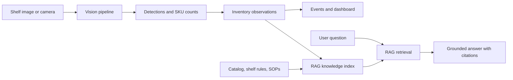

# ShelfSense documentation

ShelfSense is a local-first retail shelf vision and inventory learning project. The documentation is organized around two connected systems:

1. **Vision system** — turns shelf images into measured inventory observations.
2. **RAG assistant** — retrieves trusted project and inventory context so a user can ask questions and receive grounded, cited answers.

The RAG assistant explains and searches the system; it does not replace the vision pipeline or invent inventory counts.

## Start here

| Document | Use it to learn |
| --- | --- |
| [Learning guide](LEARNING-GUIDE.md) | How to execute the project one lesson at a time |
| [Architecture](ARCHITECTURE.md) | How the vision, inventory, and RAG systems fit together |
| [RAG system](RAG.md) | What RAG is and how we will build it safely |
| [OMLX integration](OMLX.md) | How local Apple Silicon model serving fits into RAG and optional vision helpers |
| [Roadmap](ROADMAP.md) | The order of implementation and exit criteria |
| [Decisions](DECISIONS.md) | Why the stack and boundaries were chosen |
| [Original plan](PLAN.md) | Detailed product and engineering plan |

## The product in one diagram



## The first real product slice

We begin with one shelf image and 3–5 known SKUs:

```text
upload image
  -> validate image
  -> detect products
  -> identify SKU or unknown
  -> count by SKU
  -> store observation
  -> expose result through API
```

The first RAG slice comes later and uses already-stored facts:

```text
product catalog + shelf rules + observations
  -> index trusted text
  -> retrieve relevant evidence
  -> answer a question with source references
```

## Working agreements

- Run the tests after each lesson.
- Keep raw data and model artifacts out of Git.
- Record model, dataset, configuration, and knowledge-source versions.
- Prefer `unknown` or “insufficient evidence” over a confident guess.
- Keep business rules in the domain layer, not duplicated in the UI or prompt.
- Treat retrieved text as evidence, not executable instructions.
- Measure both vision quality and answer quality.
