# ShelfSense roadmap

The roadmap is ordered by dependencies, not by how impressive a demo looks.

```mermaid
flowchart LR
    F0["Foundation"] --> F1["Image ingestion"]
    F1 --> F2["Detection baseline"]
    F2 --> F3["SKU identification"]
    F3 --> F4["Inventory rules + API"]
    F4 --> R0["RAG contract"]
    R0 --> R1["Structured retrieval"]
    R1 --> R2["OMLX embeddings"]
    R2 --> R3["Hybrid retrieval + reranking"]
    R3 --> R4["OMLX grounded generation"]
    R4 --> E["Evaluation + dashboard"]
```

## Phase exit criteria

| Phase | Done means |
| --- | --- |
| Foundation | Clean checkout installs, tests, lints, and starts the service |
| Image ingestion | Valid and invalid image requests have explicit outcomes |
| Detection | Fixture images produce boxes, confidence, versions, and diagnostics |
| Identification | Known SKUs and `unknown` are measured per SKU and condition |
| Inventory | Counts and events are deterministic, persisted, and tested |
| RAG contract | Query, evidence, citation, and abstention schemas exist |
| Structured retrieval | Known questions return correct stored facts without an LLM |
| OMLX embeddings | Local embedding calls are bounded, versioned, and tested |
| Hybrid retrieval | Exact and semantic retrieval have measured recall |
| OMLX generation | Answers cite evidence or abstain; no count is invented |
| Dashboard | UI consumes the API without duplicating domain rules |

## What we deliberately postpone

- cloud GPUs;
- multi-tenant authentication;
- live multi-camera tracking;
- automatic retraining;
- a vector database before retrieval needs it;
- a large model before a small baseline is measured;
- allowing an LLM to execute retrieved document instructions.

Each deferred item can be added later when a measured requirement justifies it.
